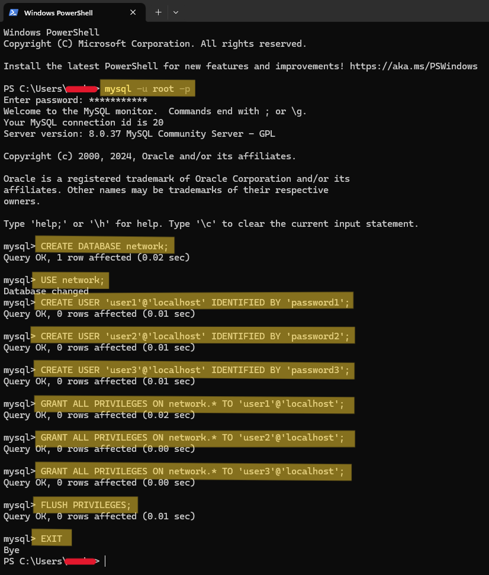

# PyTorch Network Analyzer

## Getting Started

### 1. Prerequisites

- Ensure you have Git installed. Download it from [git-scm.com](https://www.git-scm.com/).

### 2. Cloning the Project

Clone the repository using Git Bash or command line:

```sh
git clone https://github.com/nmsu-senior-project/pytorch-network-analyzer.git
```

### 3. Setting Up Python Environment

Navigate to the project directory and create a Python virtual environment:

```sh
cd pytorch-network-analyzer
python -m venv venv
```

Activate the virtual environment:

- Windows:
  ```sh
  source venv/Scripts/activate
  ```
- Linux:
  ```sh
  source venv/bin/activate
  ```

### 4. Installing Dependencies

Install required Python libraries:

```sh
pip install scapy mysql-connector-python
```

### 5. Setting Up MySQL Server

- Download and install MySQL from [dev.mysql.com](https://dev.mysql.com/downloads/installer/).
- Create a local MySQL server. Use tools like DBeaver for GUI management or command line for manual setup.

### MySQL Command-Line Interface (CLI) Setup on Windows

#### Adding MySQL to PATH Environment Variable

1. Find your MySQL Installation Directory (e.g., `C:\Program Files\MySQL\MySQL Server 8.0\bin`).
2. Add MySQL to PATH:
   - Press `Win + X` and select **System**.
   - Click on **Advanced system settings** -> **Environment Variables**.
   - Under **System variables**, edit `Path` and add your MySQL `bin` directory.
   - Restart Command Prompt to apply changes.

#### Verifying MySQL Installation

Open a new Command Prompt window and verify MySQL is recognized:

```sh
mysql -u root -p
```

#### MySQL Database and User Creation Commands ####


### Setting Up Database Credentials

Create a `credentials.txt` file in the `analyzer` directory with MySQL user credentials:

```
db_user:user1
db_pass:password1
db_user:user2
db_pass:password2
db_user:user3
db_pass:password3
```

## Project Overview

### Purpose

The project aims to develop a PyTorch-based deep learning model to analyze network traffic and detect common threat behaviors, enhancing cybersecurity measures.

### Workflow

1. **Data Processing and Baseline Creation**:
   - Process packet traffic from PCAP files.
   - Store baselines in MySQL for device network activity.

2. **Threat Analysis Using PyTorch**:
   - Train a model to monitor and alert on unusual activities.

### Future Goals

- Automate batch processing of PCAP files.
- Enhance PCAP file management for deeper analysis.
- Develop a Django web interface for model visualization.

## Summary

This project combines baseline data with PyTorch's capabilities to provide robust network security management tools, detecting and addressing potential threats effectively.
